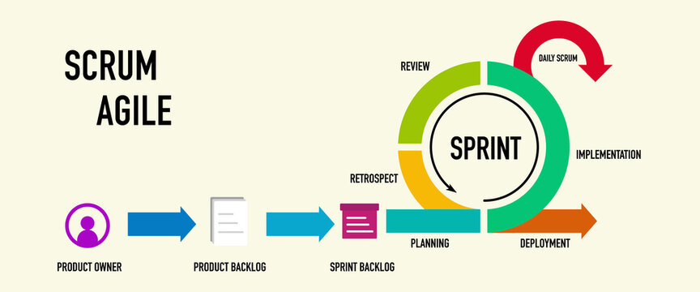
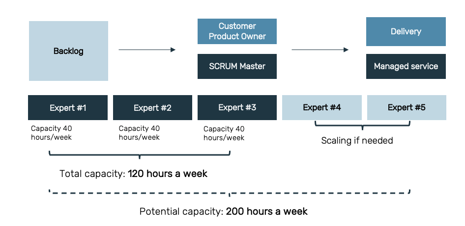
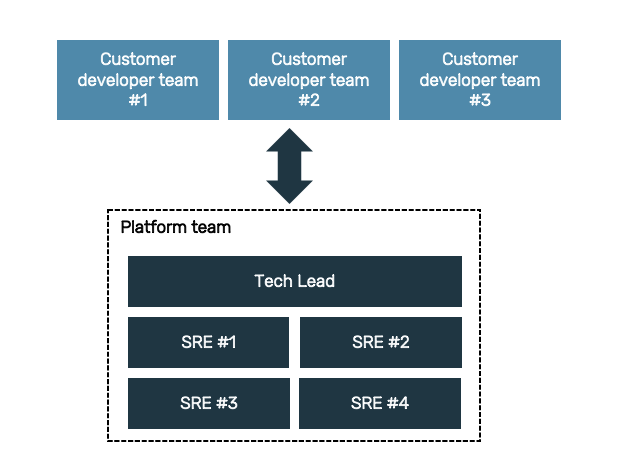

# Agile Way of Working

Agile is how we work at Fortytwo. In a nutshell, we take an iterative and incremental approach to our internal and customer deliveries -- based on the concepts of quality. transparency, flexibility and continuous improvement. 

## Benefits of Agile

* It allows Fortytwo´s high-performing and self-organizing teams to keep on learning and growing with time.

* By keeping our customers and stakeholders in the loop and making changes according to their input, we deliver value and ensure that our products and services are truly in line with their requirements.

* We significantly reduce the time to go-to-market.

* We have better control over our work due to increased visibility. Working Agile allows us to better visualize the work we are doing. This also makes predicting risks and mitigating them much easier.

* Agile allows Fortytwo teams to work in a flexible and self-managing way. We have increased autonomy and authority over our decisions through frequent and open collaboration. 

* The Agile framework also produces important metrics like lead time, cycle time and throughput that helps teams measure their own performance, identify bottlenecks, overcome pitfalls like scope creep, and gives them the ability to make data-driven decisions to correct them.

---

## Basic Fortytwo Agile Guidelines

We don't have a one specific or hard-set Agile way of working at Fortytwo. What we have is a common understanding of and respect for our inherent differences, which means we all work and interact differently -- and that's more than all right! 

To put it simply, we value the results of our work more than how we got to achieving them. 

However, there is a very fine line between agile and chaos -- so to avoid the latter, we have established some guidelines, which everyone at Fortytwo should remember as we go about our day to day:

* We work in SCRUM teams and adhere to the <a href="https://docs.amestofortytwo.com/Internal%20-%20Docs/Internal%20-%20Docs/agile-way-of-working/#agile-principles">Agile Principles</a>.

* Our teams work in sprints. The length of the sprint (from 7-14 days) will depend on what has been decided by the team.

* Each team runs a daily standup (usually no more than 15-minutes).

* Each team holds a sprint planning session at the start of the sprint to prioritize and agree on the team's scope of work for the sprint.

* Each team holds a sprint review session at the end of the sprint to go over the outcome of the sprint, with the goal of improving so the team can deliver better. This is different from a retrospective, which focuses on improving the overall system so that the team works more harmoniously and find flow together. 

* Everyone in the team is expected to join and actively participate in the abovementioned ceremonies.

* Each team has ownership of their own backlogs and roadmaps, and as such is expected to keep it populated and updated at all times (including tasks/escalations from the customer). This gives teams their heading and makes for an easy way to plan our days, weeks and months.

---

## Managing Backlogs

We use Azure DevOps to manage our internal, product and customer deliveries. This is where our code is developed, where deployments are made automatically and where our documentation is stored.

For purposes of standardization across the teams, here are a few guidelines to remember:

### Epics
- [x] Used for larger bodies of work that are comprised of many features
- [x] Identified as part of a larger strategic plan by the product owner and business
- [x] Based on the needs and requests of customers and is sized or split as necessary to be delivered by the Agile teams
- [x] Usually lasts 6 months or more (this depends on the number of features the epic has)
- [x] Should include the following: (1) associated goal, (2) description, (3) scope, (4) timeframe
- [x] Should always be used toward: (1) a team objective, (2) a product offering, or (3) customer delivery
- [x] Owned by the product owner or team lead 

### Features 
- [x] Used to break down epics into user-focused parts (the exact components vary depending on what the team is building and how they work)
- [x] Identified as part of increment planning by the product owner and the team (with support from business)
- [x] The work usually lasts 1-3 sprints (if estimates are larger, then it needs to be further broken down)
- [x] Should include the following: (1) associated epic, (2) description / user story, (3) estimate, (4) requirements as the basis of the PBIs
- [x] Owned by the product owner or can be designated to a member of the team

### Product Backlog Item (PBI)
- [x] A single element of work that exists in the product backlog (includes bugs)
- [x] Compiled and prioritized by the team lead and product owner, by putting the most urgent or important PBIs at the top
- [x] Must be a small enough increment of work to be completed during a single sprint
- [x] Should always be linked up to a Feature and be properly documented so anyone from the team can pick it up and work on it
- [x] Owned by the team member who is assigned to the task 

---

## Agile principles

**INDIVIDUALS AND INTERACTIONS** over processes and tools

**WORKING SOFTWARE** over comprehensive documentation

**CUSTOMER COLLABORATION** over contract negotiation

**RESPONDING TO CHANGE** over following a plan

---

## Multi-functional teams, scaling size when needed

The delivery team's competence and size at all times depends on what occurs in the backlog.

---

## Platform engineering team "as a service"
Our Platform Team enables and assists with necessary infrastructure elements that the development teams need, continuously, efficiently, self-service and within best practice and compliance.

